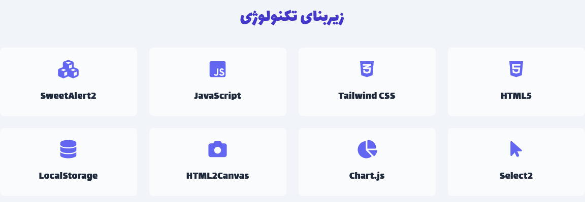
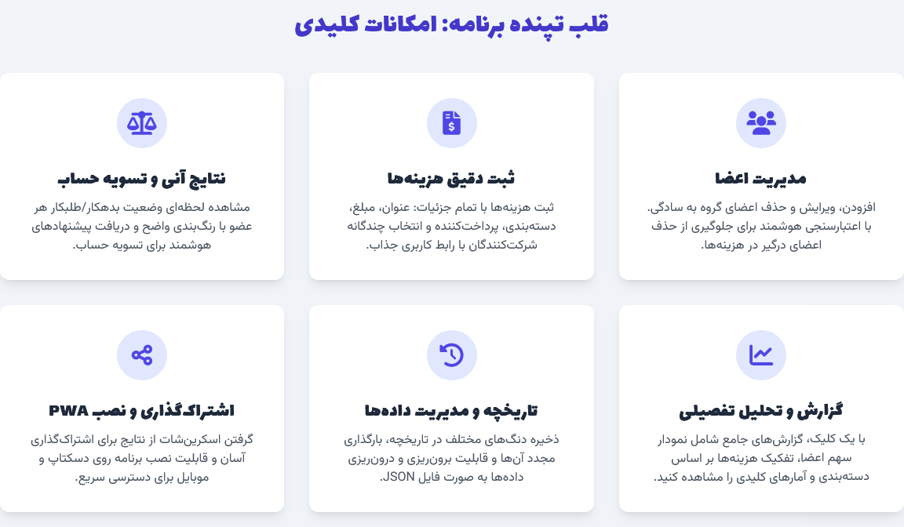
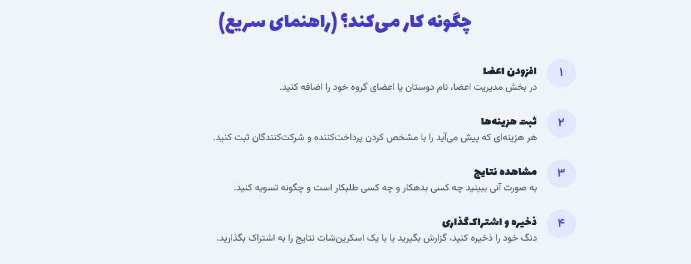
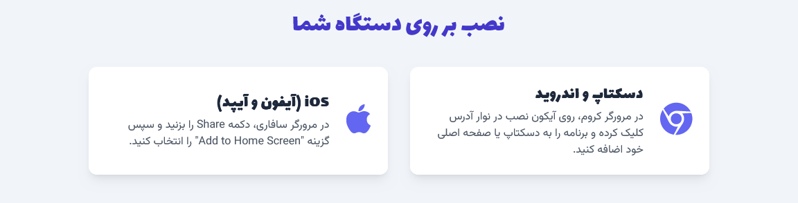

# نرم‌افزار محاسبه دنگ

این پروژه یک نرم‌افزار تحت وب کامل و کاربرپسند برای محاسبه و تقسیم هزینه‌ها در گروه‌های مختلف (دوستان، خانواده، هم‌خانه‌ای‌ها و غیره) است. با استفاده از این ابزار، می‌توانید:

- اعضا را مدیریت کنید
- هزینه‌ها را با جزئیات ثبت کنید
- نتایج دنگ را مشاهده کنید
- گزارش‌های تحلیلی دریافت نمایید

> این برنامه به صورت کاملاً آفلاین کار می‌کند و داده‌ها در حافظه محلی مرورگر شما (LocalStorage) ذخیره می‌شوند.

---

## 📐 معماری و تکنولوژی‌ها

این نرم‌افزار با رویکرد **Single Page Application (SPA)** و با تکنولوژی‌های سمت کلاینت توسعه یافته است:

- **HTML5**: برای ساختاردهی محتوای صفحه  
- **CSS3 (با Tailwind CSS)**: برای استایل‌دهی مدرن و واکنش‌گرا  
- **JavaScript (Vanilla JS و jQuery)**: برای منطق اصلی، مدیریت داده‌ها و تعاملات  
- **SweetAlert2**: جایگزین زیبا برای `alert()` و `confirm()`  
- **Select2**: برای فیلدهای انتخاب پیشرفته  
- **D3.js**: برای نمودارهای گزارش تحلیلی  
- **HTML2Canvas**: برای گرفتن اسکرین‌شات از صفحه وب

### 🧱 معماری کلی

برنامه کاملاً کلاینت‌محور است و هیچ نیازی به سرور یا پایگاه داده ندارد. داده‌ها در مرورگر ذخیره می‌شوند و حتی پس از بستن مرورگر نیز باقی می‌مانند.

---

## 🔑 امکانات کلیدی

### ۱. مدیریت اعضا

- افزودن عضو جدید
- حذف عضو (با اعتبارسنجی عدم استفاده در هزینه‌ها)
- ویرایش نام عضو (با به‌روزرسانی خودکار تمام هزینه‌های مرتبط)

### ۲. ثبت هزینه

- فیلدهایی مانند عنوان، مبلغ، دسته‌بندی، پرداخت‌کننده، شرکت‌کنندگان
- دسته‌بندی‌های پیش‌فرض (۳۰ دسته)
- استفاده از **Select2** برای انتخاب پرداخت‌کننده
- انتخاب شرکت‌کنندگان با دکمه‌های چندگانه جذاب
- اعتبارسنجی کامل فرم‌ها با **SweetAlert2**

### ۳. لیست هزینه‌ها

- نمایش جامع تمامی هزینه‌های ثبت‌شده
- مشاهده جزئیات هر هزینه
- قابلیت حذف یا ویرایش هزینه با فرم پاپ‌آپ

### ۴. نتایج دنگ

- محاسبه خودکار بالانس نهایی هر عضو
- نمایش بصری نتایج (سبز: طلبکار | قرمز: بدهکار)
- لیست تسویه‌حساب‌های پیشنهادی

### ۵. گزارش‌ها و تحلیل‌های تفصیلی

- تولید گزارش درخواستی با یک کلیک
- نمایش خلاصه کلی، نمودار مشارکت اعضا، تفکیک بر اساس دسته‌بندی
- نمایش آمار برترین پرداخت‌کننده، طلبکار و بدهکار

### ۶. تاریخچه دنگ‌ها و مدیریت داده‌ها

- ذخیره دنگ با نام دلخواه
- منوی تاریخچه در سایدبار:
  - بارگذاری دنگ ذخیره‌شده
  - حذف از تاریخچه
  - برون‌ریزی به JSON برای اشتراک‌گذاری
- برون‌ریزی/درون‌ریزی کلی داده‌ها
- راهنمای اشتراک‌گذاری فایل JSON
- یادآوری اینکه برنامه آفلاین است و همگام‌سازی ندارد

### ۷. گرفتن اسکرین‌شات و اشتراک‌گذاری

- گرفتن اسکرین‌شات از کل صفحه (شامل بخش‌های اسکرول‌شده)
- اشتراک‌گذاری از طریق Web Share API
- دانلود به صورت فایل PNG در صورت عدم پشتیبانی مرورگر

---

## 🚀 نحوه استفاده

1. فایل `index.html` را دانلود کرده و در مرورگر باز کنید.

2. **مدیریت اعضا:**
    - نام را وارد کرده و روی "اضافه کردن عضو" کلیک کنید.
    - امکان ویرایش یا حذف اعضا وجود دارد.

3. **ثبت هزینه:**
    - عنوان، مبلغ، دسته‌بندی و پرداخت‌کننده را وارد کنید.
    - شرکت‌کنندگان را با کلیک بر روی دکمه‌ها انتخاب کنید.
    - روی "ثبت هزینه" کلیک کنید.

4. **مشاهده نتایج:**
    - در بخش "نتایج دنگ"، بالانس نهایی و تسویه‌حساب‌ها نمایش داده می‌شوند.

5. **گزارش‌ها:**
    - روی "تولید گزارش" کلیک کنید تا نمودارها و تحلیل‌ها نمایش داده شوند.

6. **ذخیره و بارگذاری دنگ:**
    - روی "ذخیره دنگ فعلی" کلیک کنید.
    - از منوی همبرگری (☰) برای مدیریت تاریخچه و فایل‌های JSON استفاده کنید.

7. **اسکرین‌شات:**
    - روی "گرفتن اسکرین‌شات و اشتراک‌گذاری" کلیک کنید.

---

## 📲 نصب به عنوان PWA

این برنامه **Progressive Web App (PWA)** است و می‌توانید آن را روی دستگاه خود نصب کنید:

- **در Chrome (دسکتاپ یا اندروید):**
  - آیکون نصب (+) در نوار آدرس را انتخاب کنید.

- **در Safari (iOS):**
  - روی Share بزنید، سپس "Add to Home Screen" را انتخاب کنید.

---

## 🤝 توسعه و مشارکت

این پروژه **متن‌باز** است و از مشارکت شما استقبال می‌کند. برای مشارکت:

1. پروژه را Fork کنید  
2. یک Branch جدید بسازید  
3. تغییرات خود را اعمال کنید  
4. Pull Request ارسال کنید

---

## 📁 مجوز

این پروژه تحت مجوز MIT منتشر شده است.
